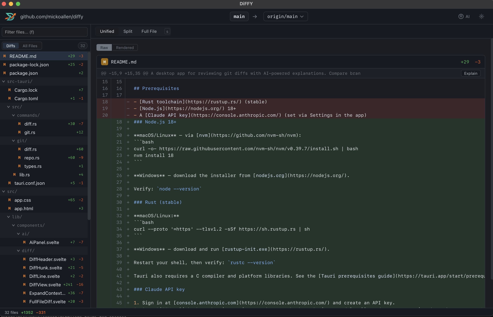
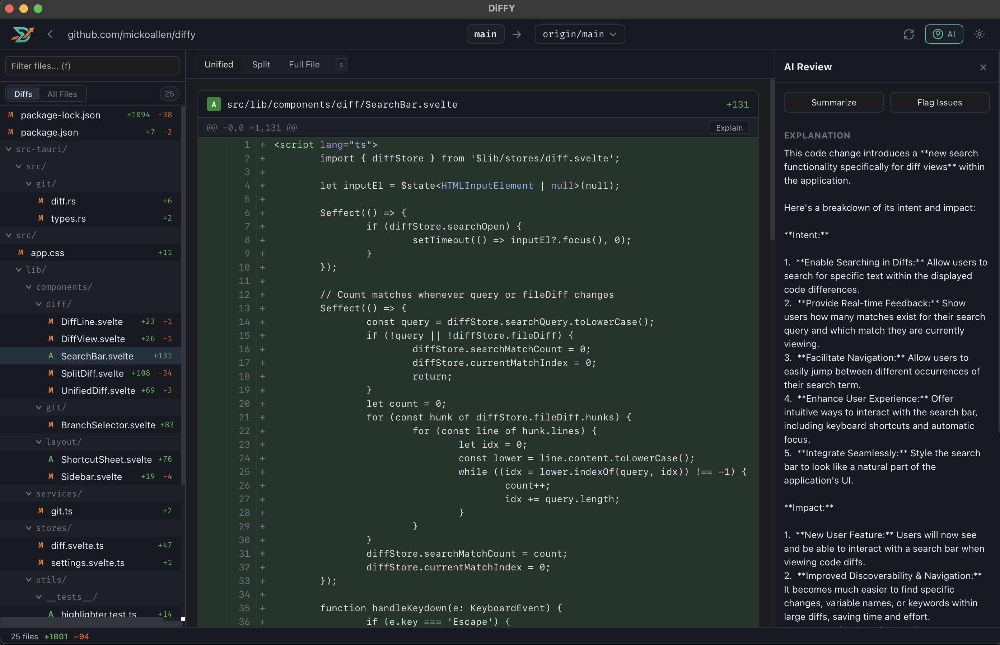

# DiFFY

<p align="center">
  
</p>

<p align="center">
  
</p>

A desktop app for reviewing git diffs with AI-powered explanations. Compare branches, inspect commits, and get plain-language summaries of code changes — all without leaving your desktop.

## Features

- **Git diff viewer** — browse file-by-file diffs with syntax highlighting
- **Branch comparison** — compare any two branches or commits in a local repo
- **Syntax highlighting** — diffs rendered with language-aware coloring
- **AI-powered explanations** — get instant plain-language summaries of changes using Claude, OpenAI, Gemini, or local models via Ollama / LM Studio

<p align="center">
  
</p>

## Prerequisites

### Node.js 18+

**macOS/Linux** — via [nvm](https://github.com/nvm-sh/nvm):
```bash
curl -o- https://raw.githubusercontent.com/nvm-sh/nvm/v0.39.7/install.sh | bash
nvm install 18
```

**Windows** — download the installer from [nodejs.org](https://nodejs.org/).

Verify: `node --version`

### Rust (stable)

**macOS/Linux:**
```bash
curl --proto '=https' --tlsv1.2 -sSf https://sh.rustup.rs | sh
```

**Windows** — download and run [rustup-init.exe](https://rustup.rs/).

Restart your shell, then verify: `rustc --version`

Tauri also requires a C compiler and platform libraries. See the [Tauri prerequisites guide](https://tauri.app/start/prerequisites/) for OS-specific steps (e.g. `xcode-select --install` on macOS, `build-essential` on Ubuntu).

### AI provider (optional)

DiFFY supports multiple AI backends. Open **Settings** in the app and choose your provider:

- **Claude** — paste an API key from [console.anthropic.com](https://console.anthropic.com/)
- **OpenAI** — paste an API key from [platform.openai.com](https://platform.openai.com/)
- **Gemini** — paste an API key from [aistudio.google.com](https://aistudio.google.com/)
- **Ollama / LM Studio** — point to your local server (no key needed)

Keys are stored locally and only sent to the selected provider's API.

## Development

```bash
npm install
npm run tauri dev
```

The app opens at `localhost:1420`. Changes to the SvelteKit frontend hot-reload automatically; Rust backend changes trigger a recompile.

## Build

```bash
npm run tauri build
```

Produces a platform-native installer in `src-tauri/target/release/bundle/`.

## Tech Stack

- [Tauri 2](https://tauri.app/) — Rust-based desktop shell
- [SvelteKit 5](https://svelte.dev/) — frontend framework
- [TypeScript](https://www.typescriptlang.org/) — frontend types
- AI — Claude, OpenAI, Gemini, Ollama, or LM Studio
